# enabling-mcp-sdlc
Template MCP server providing agent modes for SDLC workflows (spec, implementer, tester, review, deployment)

## Agent Modes Architecture

```mermaid
graph TB
    %% Agent Modes with Human in Loop side by side
    subgraph S1[" "]
        SPEC["📋 spec<br/>Requirements"] 
        H1["👤 Human<br/>Iterate"]
        SPEC --- H1
    end
    
    subgraph S2[" "]
        IMPL["⚙️ implementer<br/>Code"]
        H2["👤 Human<br/>Iterate"]
        IMPL --- H2
    end
    
    subgraph S3[" "]
        TEST["🧪 tester<br/>Tests"]
        H3["👤 Human<br/>Iterate"]
        TEST --- H3
    end
    
    subgraph S4[" "]
        REV["🔍 review<br/>Quality"]
        H4["👤 Human<br/>Iterate"]
        REV --- H4
    end
    
    subgraph S5[" "]
        DEP["🚀 deployment<br/>Release"]
        H5["👤 Human<br/>Iterate"]
        DEP --- H5
    end
    
    SUPPORT["🛠️ Supporting Components<br/>Validation • Templates • Prompts"]
    
    %% Flow between stages
    S1 --> S2
    S2 --> S3
    S3 --> S4
    S4 --> S5
    
    %% Can iterate back
    S2 -.-> S1
    S3 -.-> S2
    S4 -.-> S3
    S5 -.-> S4
    
    %% Support assists all
    SUPPORT -.-> S1
    SUPPORT -.-> S2
    SUPPORT -.-> S3
    SUPPORT -.-> S4
    SUPPORT -.-> S5
    
    %% Styling
    classDef agentStyle fill:#c8e6c9,stroke:#388e3c,stroke-width:2px
    classDef humanStyle fill:#e3f2fd,stroke:#1976d2,stroke-width:3px
    classDef supportStyle fill:#fff9c4,stroke:#f57c00,stroke-width:2px
    
    class SPEC,IMPL,TEST,REV,DEP agentStyle
    class H1,H2,H3,H4,H5 humanStyle
    class SUPPORT supportStyle
```

---

### Alternative View (Horizontal Flow)

```mermaid
graph LR
    SUPPORT["🛠️ Support<br/>Validation<br/>Templates<br/>Prompts"]
    
    SPEC["📋 spec<br/>Requirements"]
    H1["👤"]
    
    IMPL["⚙️ implementer<br/>Code"]
    H2["👤"]
    
    TEST["🧪 tester<br/>Tests"]
    H3["👤"]
    
    REV["🔍 review<br/>Quality"]
    H4["👤"]
    
    DEP["🚀 deployment<br/>Release"]
    H5["👤"]
    
    %% Forward flow
    SPEC --> IMPL --> TEST --> REV --> DEP
    
    %% Human iteration loops
    SPEC <-.-> H1
    IMPL <-.-> H2
    TEST <-.-> H3
    REV <-.-> H4
    DEP <-.-> H5
    
    %% Backward iteration
    IMPL -.-> SPEC
    TEST -.-> IMPL
    REV -.-> TEST
    DEP -.-> REV
    
    %% Support from top
    SUPPORT -.-> SPEC
    SUPPORT -.-> IMPL
    SUPPORT -.-> TEST
    SUPPORT -.-> REV
    SUPPORT -.-> DEP
    
    %% Styling
    classDef agentStyle fill:#c8e6c9,stroke:#388e3c,stroke-width:2px
    classDef humanStyle fill:#e3f2fd,stroke:#1976d2,stroke-width:3px
    classDef supportStyle fill:#fff9c4,stroke:#f57c00,stroke-width:2px
    
    class SPEC,IMPL,TEST,REV,DEP agentStyle
    class H1,H2,H3,H4,H5 humanStyle
    class SUPPORT supportStyle
```

---

### Alternative View 3 (With Quality Gates)

```mermaid
graph TB
    %% Support Component
    SUPPORT["🛠️ Support • Validation • Templates • Prompts"]
    
    %% Agent phases with quality gates and human collaboration
    Q1["✓ Quality Agent"]
    SPEC["📋 spec<br/>Requirements"]
    H1["👤 Human"]
    
    Q2["✓ Quality Agent"]
    IMPL["⚙️ implementer<br/>Code"]
    H2["👤 Human"]
    
    Q3["✓ Quality Agent"]
    TEST["🧪 tester<br/>Tests"]
    H3["👤 Human"]
    
    Q4["✓ Quality Agent"]
    REV["🔍 review<br/>Quality"]
    H4["👤 Human"]
    
    Q5["✓ Quality Agent"]
    DEP["🚀 deployment<br/>Release"]
    H5["👤 Human"]
    
    %% Main iterative flow
    SPEC <--> IMPL <--> TEST <--> REV <--> DEP
    
    %% Quality gates
    Q1 <-.-> SPEC
    Q2 <-.-> IMPL
    Q3 <-.-> TEST
    Q4 <-.-> REV
    Q5 <-.-> DEP
    
    %% Human collaboration
    SPEC <-.-> H1
    IMPL <-.-> H2
    TEST <-.-> H3
    REV <-.-> H4
    DEP <-.-> H5
    
    %% Support connections
    SUPPORT -.-> SPEC
    SUPPORT -.-> IMPL
    SUPPORT -.-> TEST
    SUPPORT -.-> REV
    SUPPORT -.-> DEP
    
    %% Styling
    classDef agentStyle fill:#c8e6c9,stroke:#388e3c,stroke-width:2px
    classDef humanStyle fill:#e3f2fd,stroke:#1976d2,stroke-width:3px
    classDef qualityStyle fill:#fff3e0,stroke:#e65100,stroke-width:2px
    classDef supportStyle fill:#fff9c4,stroke:#f57c00,stroke-width:2px
    
    class SPEC,IMPL,TEST,REV,DEP agentStyle
    class H1,H2,H3,H4,H5 humanStyle
    class Q1,Q2,Q3,Q4,Q5 qualityStyle
    class SUPPORT supportStyle
```

